## &#x1F4CA; Summary:

<ul>
            <li>Total Projects: 16</li>
            <li>Last Update: Mon, 04 May 2026 03:22:33 GMT</li>
            <li>Passed: 16</li>
            <li>Failed: 0</li>
            <li>Duration: 
              120.05 sec
            </li>
          </ul>

  

## &#x1F4C5; Last 90 Days:
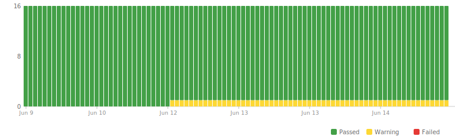

## &#x1F4DD; Projects:
<table>
            <thead>
              <tr>
                <th>Project</th>
                <th>Repo</th>
                <th>Deployed</th>
                <th>Status</th>
                <th>Passed</th>
                <th>Duration(s)</th>
              </tr>
            </thead>
            <tbody>
              <tr>
                    <td><a href="https://admin-dashboard-next-roan.vercel.app">admin-dashboard-next</a></td>
                    <td><a href="https://github.com/wrujel/admin-dashboard-next">Link</a></td>
                    <td></td>
                    <td>✅</td>
                    <td>4/4</td>
                    <td align='right'>5.87</td>
                  </tr><tr>
                    <td><a href="https://demo-airbnb-clone-three-phi-45.vercel.app/">airbnb-clone</a></td>
                    <td><a href="https://github.com/wrujel/airbnb-clone">Link</a></td>
                    <td></td>
                    <td>✅</td>
                    <td>5/5</td>
                    <td align='right'>14.30</td>
                  </tr><tr>
                    <td><a href="https://blog.wrujel.com">blog</a></td>
                    <td>-</td>
                    <td></td>
                    <td>✅</td>
                    <td>10/10</td>
                    <td align='right'>31.88</td>
                  </tr><tr>
                    <td><a href="https://clock-app-wrujel.vercel.app">clock-app</a></td>
                    <td><a href="https://github.com/wrujel/clock-app">Link</a></td>
                    <td></td>
                    <td>✅</td>
                    <td>1/1</td>
                    <td align='right'>2.15</td>
                  </tr><tr>
                    <td><a href="https://django-crud-react.onrender.com">django-crud-react</a></td>
                    <td><a href="https://github.com/wrujel/django-crud-react">Link</a></td>
                    <td></td>
                    <td>✅</td>
                    <td>2/2</td>
                    <td align='right'>2.56</td>
                  </tr><tr>
                    <td><a href="https://github-history.vercel.app">github-history</a></td>
                    <td><a href="https://github.com/wrujel/github-history">Link</a></td>
                    <td></td>
                    <td>✅</td>
                    <td>2/2</td>
                    <td align='right'>0.66</td>
                  </tr><tr>
                    <td><a href="https://leetcode-tracker-qvf.pages.dev">leetcode-ui</a></td>
                    <td>-</td>
                    <td></td>
                    <td>✅</td>
                    <td>12/12</td>
                    <td align='right'>12.41</td>
                  </tr><tr>
                    <td><a href="https://movies-search-five.vercel.app">movies-search</a></td>
                    <td><a href="https://github.com/wrujel/movies-search">Link</a></td>
                    <td></td>
                    <td>✅</td>
                    <td>2/2</td>
                    <td align='right'>1.39</td>
                  </tr><tr>
                    <td><a href="https://movies-app-o2ff-git-main-wrujels-projects.vercel.app">netflix-clone</a></td>
                    <td><a href="https://github.com/wrujel/netflix-clone">Link</a></td>
                    <td></td>
                    <td>✅</td>
                    <td>5/5</td>
                    <td align='right'>11.32</td>
                  </tr><tr>
                    <td><a href="https://portfolio-web-wrujel.vercel.app">portfolio-web-template</a></td>
                    <td><a href="https://github.com/wrujel/portfolio-web-template">Link</a></td>
                    <td></td>
                    <td>✅</td>
                    <td>7/7</td>
                    <td align='right'>3.13</td>
                  </tr><tr>
                    <td><a href="https://wrujel.com">portfolio</a></td>
                    <td>-</td>
                    <td></td>
                    <td>✅</td>
                    <td>11/11</td>
                    <td align='right'>8.81</td>
                  </tr><tr>
                    <td><a href="https://rest-api-et.onrender.com">rest-api-et</a></td>
                    <td><a href="https://github.com/wrujel/rest-api-et">Link</a></td>
                    <td></td>
                    <td>✅</td>
                    <td>3/3</td>
                    <td align='right'>20.77</td>
                  </tr><tr>
                    <td><a href="https://ephemeral-zuccutto-49ec06.netlify.app">slider-static</a></td>
                    <td><a href="https://github.com/wrujel/slider-static">Link</a></td>
                    <td></td>
                    <td>✅</td>
                    <td>1/1</td>
                    <td align='right'>2.27</td>
                  </tr><tr>
                    <td><a href="https://sage-daffodil-4904c3.netlify.app">tesla-landing</a></td>
                    <td><a href="https://github.com/wrujel/tesla-landing">Link</a></td>
                    <td></td>
                    <td>✅</td>
                    <td>3/3</td>
                    <td align='right'>1.80</td>
                  </tr><tr>
                    <td><a href="https://tetris-javascript-pi.vercel.app">tetris-javascript</a></td>
                    <td><a href="https://github.com/wrujel/tetris-javascript">Link</a></td>
                    <td></td>
                    <td>✅</td>
                    <td>1/1</td>
                    <td align='right'>0.22</td>
                  </tr><tr>
                    <td><a href="https://webpage-gpt-wrujels-projects.vercel.app/">webpage-gpt</a></td>
                    <td><a href="https://github.com/wrujel/webpage-gpt">Link</a></td>
                    <td></td>
                    <td>✅</td>
                    <td>1/1</td>
                    <td align='right'>0.52</td>
                  </tr>
            </tbody>
          </table>
  

## &#x1F3AF; Tests:
<table>
            <thead>
              <tr>
                <th>Project</th>
                <th>Tests</th>
                <th>Status</th>
                <th>Duration(s)</th>
              </tr>
            </thead>
            <tbody>
              <tr>
                          <td>admin-dashboard-next</td>
                          <td>Test sidebar and search</td>
                          <td>✅</td>
                          <td align='right'>1.63</td>
                        </tr><tr>
                          <td>admin-dashboard-next</td>
                          <td>Test dashboard page</td>
                          <td>✅</td>
                          <td align='right'>0.42</td>
                        </tr><tr>
                          <td>admin-dashboard-next</td>
                          <td>Test users page</td>
                          <td>✅</td>
                          <td align='right'>2.25</td>
                        </tr><tr>
                          <td>admin-dashboard-next</td>
                          <td>Test products page</td>
                          <td>✅</td>
                          <td align='right'>1.56</td>
                        </tr><tr>
                          <td>airbnb-clone</td>
                          <td>Test home without logging in</td>
                          <td>✅</td>
                          <td align='right'>1.15</td>
                        </tr><tr>
                          <td>airbnb-clone</td>
                          <td>Test email register</td>
                          <td>✅</td>
                          <td align='right'>3.14</td>
                        </tr><tr>
                          <td>airbnb-clone</td>
                          <td>Test gmail login</td>
                          <td>✅</td>
                          <td align='right'>2.96</td>
                        </tr><tr>
                          <td>airbnb-clone</td>
                          <td>Test github login</td>
                          <td>✅</td>
                          <td align='right'>1.96</td>
                        </tr><tr>
                          <td>airbnb-clone</td>
                          <td>Test home logged in</td>
                          <td>✅</td>
                          <td align='right'>5.10</td>
                        </tr><tr>
                          <td>blog</td>
                          <td>Navbar</td>
                          <td>✅</td>
                          <td align='right'>1.95</td>
                        </tr><tr>
                          <td>blog</td>
                          <td>Hero section</td>
                          <td>✅</td>
                          <td align='right'>1.68</td>
                        </tr><tr>
                          <td>blog</td>
                          <td>Category showcase</td>
                          <td>✅</td>
                          <td align='right'>1.76</td>
                        </tr><tr>
                          <td>blog</td>
                          <td>Latest articles</td>
                          <td>✅</td>
                          <td align='right'>1.72</td>
                        </tr><tr>
                          <td>blog</td>
                          <td>Subscribe section</td>
                          <td>✅</td>
                          <td align='right'>4.63</td>
                        </tr><tr>
                          <td>blog</td>
                          <td>Footer</td>
                          <td>✅</td>
                          <td align='right'>1.75</td>
                        </tr><tr>
                          <td>blog</td>
                          <td>Explore page</td>
                          <td>✅</td>
                          <td align='right'>5.04</td>
                        </tr><tr>
                          <td>blog</td>
                          <td>Blog post page</td>
                          <td>✅</td>
                          <td align='right'>6.85</td>
                        </tr><tr>
                          <td>blog</td>
                          <td>Locale</td>
                          <td>✅</td>
                          <td align='right'>4.80</td>
                        </tr><tr>
                          <td>blog</td>
                          <td>Theme toggle</td>
                          <td>✅</td>
                          <td align='right'>1.69</td>
                        </tr><tr>
                          <td>clock-app</td>
                          <td>Test home page</td>
                          <td>✅</td>
                          <td align='right'>2.15</td>
                        </tr><tr>
                          <td>django-crud-react</td>
                          <td>Test home</td>
                          <td>✅</td>
                          <td align='right'>1.28</td>
                        </tr><tr>
                          <td>django-crud-react</td>
                          <td>Test create new task</td>
                          <td>✅</td>
                          <td align='right'>1.28</td>
                        </tr><tr>
                          <td>github-history</td>
                          <td>Test home</td>
                          <td>✅</td>
                          <td align='right'>0.30</td>
                        </tr><tr>
                          <td>github-history</td>
                          <td>Test select a repo</td>
                          <td>✅</td>
                          <td align='right'>0.36</td>
                        </tr><tr>
                          <td>leetcode-ui</td>
                          <td>Navbar</td>
                          <td>✅</td>
                          <td align='right'>0.24</td>
                        </tr><tr>
                          <td>leetcode-ui</td>
                          <td>Stat cards</td>
                          <td>✅</td>
                          <td align='right'>0.27</td>
                        </tr><tr>
                          <td>leetcode-ui</td>
                          <td>View switcher</td>
                          <td>✅</td>
                          <td align='right'>1.66</td>
                        </tr><tr>
                          <td>leetcode-ui</td>
                          <td>Problem list</td>
                          <td>✅</td>
                          <td align='right'>2.10</td>
                        </tr><tr>
                          <td>leetcode-ui</td>
                          <td>Difficulty filter</td>
                          <td>✅</td>
                          <td align='right'>1.22</td>
                        </tr><tr>
                          <td>leetcode-ui</td>
                          <td>Search functionality</td>
                          <td>✅</td>
                          <td align='right'>2.40</td>
                        </tr><tr>
                          <td>leetcode-ui</td>
                          <td>Pagination</td>
                          <td>✅</td>
                          <td align='right'>1.14</td>
                        </tr><tr>
                          <td>leetcode-ui</td>
                          <td>Problem detail page</td>
                          <td>✅</td>
                          <td align='right'>0.31</td>
                        </tr><tr>
                          <td>leetcode-ui</td>
                          <td>Problem detail navigation</td>
                          <td>✅</td>
                          <td align='right'>0.26</td>
                        </tr><tr>
                          <td>leetcode-ui</td>
                          <td>Charts view</td>
                          <td>✅</td>
                          <td align='right'>2.26</td>
                        </tr><tr>
                          <td>leetcode-ui</td>
                          <td>Footer links</td>
                          <td>✅</td>
                          <td align='right'>0.25</td>
                        </tr><tr>
                          <td>leetcode-ui</td>
                          <td>404 page</td>
                          <td>✅</td>
                          <td align='right'>0.30</td>
                        </tr><tr>
                          <td>movies-search</td>
                          <td>Test page</td>
                          <td>✅</td>
                          <td align='right'>0.26</td>
                        </tr><tr>
                          <td>movies-search</td>
                          <td>Test search</td>
                          <td>✅</td>
                          <td align='right'>1.12</td>
                        </tr><tr>
                          <td>netflix-clone</td>
                          <td>Test home without logging in</td>
                          <td>✅</td>
                          <td align='right'>3.50</td>
                        </tr><tr>
                          <td>netflix-clone</td>
                          <td>Test email register</td>
                          <td>✅</td>
                          <td align='right'>2.52</td>
                        </tr><tr>
                          <td>netflix-clone</td>
                          <td>Test google login</td>
                          <td>✅</td>
                          <td align='right'>0.40</td>
                        </tr><tr>
                          <td>netflix-clone</td>
                          <td>Test github login</td>
                          <td>✅</td>
                          <td align='right'>1.21</td>
                        </tr><tr>
                          <td>netflix-clone</td>
                          <td>Test home logged in</td>
                          <td>✅</td>
                          <td align='right'>3.69</td>
                        </tr><tr>
                          <td>portfolio-web-template</td>
                          <td>Home page</td>
                          <td>✅</td>
                          <td align='right'>0.39</td>
                        </tr><tr>
                          <td>portfolio-web-template</td>
                          <td>Sidebar</td>
                          <td>✅</td>
                          <td align='right'>0.36</td>
                        </tr><tr>
                          <td>portfolio-web-template</td>
                          <td>About page</td>
                          <td>✅</td>
                          <td align='right'>0.47</td>
                        </tr><tr>
                          <td>portfolio-web-template</td>
                          <td>Services page</td>
                          <td>✅</td>
                          <td align='right'>0.40</td>
                        </tr><tr>
                          <td>portfolio-web-template</td>
                          <td>Projects page</td>
                          <td>✅</td>
                          <td align='right'>0.60</td>
                        </tr><tr>
                          <td>portfolio-web-template</td>
                          <td>Costumers page</td>
                          <td>✅</td>
                          <td align='right'>0.57</td>
                        </tr><tr>
                          <td>portfolio-web-template</td>
                          <td>Contact page</td>
                          <td>✅</td>
                          <td align='right'>0.36</td>
                        </tr><tr>
                          <td>portfolio</td>
                          <td>Hero section</td>
                          <td>✅</td>
                          <td align='right'>1.27</td>
                        </tr><tr>
                          <td>portfolio</td>
                          <td>Navbar links</td>
                          <td>✅</td>
                          <td align='right'>0.72</td>
                        </tr><tr>
                          <td>portfolio</td>
                          <td>About section</td>
                          <td>✅</td>
                          <td align='right'>0.77</td>
                        </tr><tr>
                          <td>portfolio</td>
                          <td>Projects section</td>
                          <td>✅</td>
                          <td align='right'>0.68</td>
                        </tr><tr>
                          <td>portfolio</td>
                          <td>Skills section</td>
                          <td>✅</td>
                          <td align='right'>0.86</td>
                        </tr><tr>
                          <td>portfolio</td>
                          <td>LeetCode section</td>
                          <td>✅</td>
                          <td align='right'>0.64</td>
                        </tr><tr>
                          <td>portfolio</td>
                          <td>Services section</td>
                          <td>✅</td>
                          <td align='right'>0.66</td>
                        </tr><tr>
                          <td>portfolio</td>
                          <td>Contact section</td>
                          <td>✅</td>
                          <td align='right'>0.66</td>
                        </tr><tr>
                          <td>portfolio</td>
                          <td>Footer</td>
                          <td>✅</td>
                          <td align='right'>0.51</td>
                        </tr><tr>
                          <td>portfolio</td>
                          <td>Projects page</td>
                          <td>✅</td>
                          <td align='right'>0.89</td>
                        </tr><tr>
                          <td>portfolio</td>
                          <td>Locale</td>
                          <td>✅</td>
                          <td align='right'>1.14</td>
                        </tr><tr>
                          <td>rest-api-et</td>
                          <td>Test home without logging in</td>
                          <td>✅</td>
                          <td align='right'>1.22</td>
                        </tr><tr>
                          <td>rest-api-et</td>
                          <td>Test register and login</td>
                          <td>✅</td>
                          <td align='right'>4.67</td>
                        </tr><tr>
                          <td>rest-api-et</td>
                          <td>Test crud products</td>
                          <td>✅</td>
                          <td align='right'>14.88</td>
                        </tr><tr>
                          <td>slider-static</td>
                          <td>Test home</td>
                          <td>✅</td>
                          <td align='right'>2.27</td>
                        </tr><tr>
                          <td>tesla-landing</td>
                          <td>Test home</td>
                          <td>✅</td>
                          <td align='right'>1.15</td>
                        </tr><tr>
                          <td>tesla-landing</td>
                          <td>Test second section</td>
                          <td>✅</td>
                          <td align='right'>0.34</td>
                        </tr><tr>
                          <td>tesla-landing</td>
                          <td>Test last section</td>
                          <td>✅</td>
                          <td align='right'>0.31</td>
                        </tr><tr>
                          <td>tetris-javascript</td>
                          <td>Test home</td>
                          <td>✅</td>
                          <td align='right'>0.22</td>
                        </tr><tr>
                          <td>webpage-gpt</td>
                          <td>Test project</td>
                          <td>✅</td>
                          <td align='right'>0.52</td>
                        </tr>
            </tbody>
          </table>
  

## &#x1F4C8; Projects Trends (Last 90 Days):
<table><tr><td>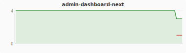</td><td>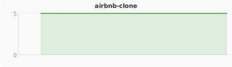</td></tr><tr><td>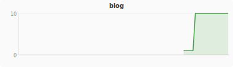</td><td>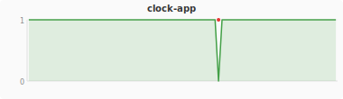</td></tr><tr><td>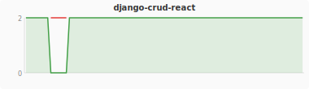</td><td>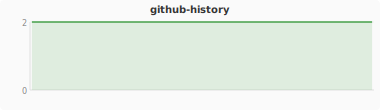</td></tr><tr><td>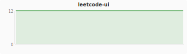</td><td>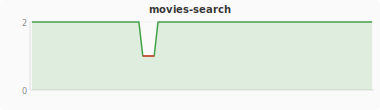</td></tr><tr><td>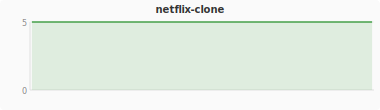</td><td>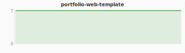</td></tr><tr><td>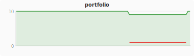</td><td>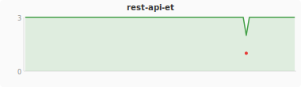</td></tr><tr><td>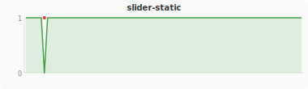</td><td>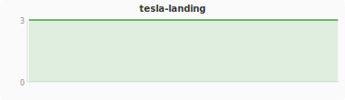</td></tr><tr><td>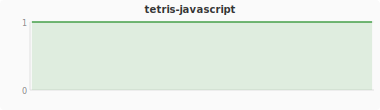</td><td>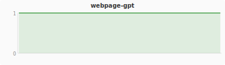</td></tr></table>