## &#x1F4CA; Summary:

<ul>
            <li>Total Projects: 16</li>
            <li>Last Update: Fri, 14 Aug 2026 17:44:59 GMT</li>
            <li>Passed: 15</li>
            <li>Failed: 1</li>
            <li>Duration: 
              491.16 sec
            </li>
          </ul>

  

## &#x1F4C5; Last 90 Days:
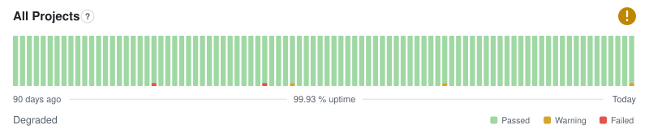

## &#x1F4DD; Projects:
<table>
            <thead>
              <tr>
                <th>Project</th>
                <th>Repo</th>
                <th>Deployed</th>
                <th>Status</th>
                <th>Passed</th>
                <th>Duration(s)</th>
              </tr>
            </thead>
            <tbody>
              <tr>
                    <td><a href="https://admin-dashboard-next-roan.vercel.app/">admin-dashboard-next</a></td>
                    <td><a href="https://github.com/wrujel/admin-dashboard-next">Link</a></td>
                    <td></td>
                    <td>✅</td>
                    <td>2/2</td>
                    <td align='right'>10.45</td>
                  </tr><tr>
                    <td><a href="https://demo-airbnb-clone-three-phi-45.vercel.app/">airbnb-clone</a></td>
                    <td><a href="https://github.com/wrujel/airbnb-clone">Link</a></td>
                    <td></td>
                    <td>✅</td>
                    <td>5/5</td>
                    <td align='right'>17.03</td>
                  </tr><tr>
                    <td><a href="https://blog.wrujel.com">blog</a></td>
                    <td><a href="https://github.com/wrujel/blog">Link</a></td>
                    <td></td>
                    <td>✅</td>
                    <td>10/10</td>
                    <td align='right'>82.06</td>
                  </tr><tr>
                    <td><a href="https://clock-app-wrujel.vercel.app">clock-app</a></td>
                    <td><a href="https://github.com/wrujel/clock-app">Link</a></td>
                    <td></td>
                    <td>✅</td>
                    <td>6/6</td>
                    <td align='right'>16.95</td>
                  </tr><tr>
                    <td><a href="https://django-crud-react.onrender.com">django-crud-react</a></td>
                    <td><a href="https://github.com/wrujel/django-crud-react">Link</a></td>
                    <td></td>
                    <td>✅</td>
                    <td>2/2</td>
                    <td align='right'>70.95</td>
                  </tr><tr>
                    <td><a href="https://github-history.vercel.app">github-history</a></td>
                    <td><a href="https://github.com/wrujel/github-history">Link</a></td>
                    <td></td>
                    <td>✅</td>
                    <td>5/5</td>
                    <td align='right'>16.33</td>
                  </tr><tr>
                    <td><a href="https://leetcode.wrujel.website/">leetcode-ui</a></td>
                    <td><a href="https://github.com/wrujel/leetcode-ui">Link</a></td>
                    <td></td>
                    <td>✅</td>
                    <td>19/19</td>
                    <td align='right'>25.16</td>
                  </tr><tr>
                    <td><a href="https://movies-search-five.vercel.app">movies-search</a></td>
                    <td><a href="https://github.com/wrujel/movies-search">Link</a></td>
                    <td></td>
                    <td>⚠️</td>
                    <td>2/3</td>
                    <td align='right'>53.63</td>
                  </tr><tr>
                    <td><a href="https://movies-app-o2ff-git-main-wrujels-projects.vercel.app">netflix-clone</a></td>
                    <td><a href="https://github.com/wrujel/netflix-clone">Link</a></td>
                    <td></td>
                    <td>✅</td>
                    <td>5/5</td>
                    <td align='right'>16.45</td>
                  </tr><tr>
                    <td><a href="https://wrujel.com">portfolio</a></td>
                    <td><a href="https://github.com/wrujel/portfolio">Link</a></td>
                    <td></td>
                    <td>✅</td>
                    <td>22/22</td>
                    <td align='right'>42.59</td>
                  </tr><tr>
                    <td><a href="https://portfolio-web-wrujel.vercel.app">portfolio-web-template</a></td>
                    <td><a href="https://github.com/wrujel/portfolio-web-template">Link</a></td>
                    <td></td>
                    <td>✅</td>
                    <td>7/7</td>
                    <td align='right'>7.52</td>
                  </tr><tr>
                    <td><a href="https://rest-api-et.onrender.com">rest-api-et</a></td>
                    <td><a href="https://github.com/wrujel/rest-api-et">Link</a></td>
                    <td></td>
                    <td>✅</td>
                    <td>6/6</td>
                    <td align='right'>105.82</td>
                  </tr><tr>
                    <td><a href="https://ephemeral-zuccutto-49ec06.netlify.app">slider-static</a></td>
                    <td><a href="https://github.com/wrujel/slider-static">Link</a></td>
                    <td></td>
                    <td>✅</td>
                    <td>1/1</td>
                    <td align='right'>1.54</td>
                  </tr><tr>
                    <td><a href="https://sage-daffodil-4904c3.netlify.app">tesla-landing</a></td>
                    <td><a href="https://github.com/wrujel/tesla-landing">Link</a></td>
                    <td></td>
                    <td>✅</td>
                    <td>3/3</td>
                    <td align='right'>3.36</td>
                  </tr><tr>
                    <td><a href="https://tetris-javascript-pi.vercel.app">tetris-javascript</a></td>
                    <td><a href="https://github.com/wrujel/tetris-javascript">Link</a></td>
                    <td></td>
                    <td>✅</td>
                    <td>3/3</td>
                    <td align='right'>8.11</td>
                  </tr><tr>
                    <td><a href="https://webpage-gpt-wrujels-projects.vercel.app/">webpage-gpt</a></td>
                    <td><a href="https://github.com/wrujel/webpage-gpt">Link</a></td>
                    <td></td>
                    <td>✅</td>
                    <td>11/11</td>
                    <td align='right'>13.19</td>
                  </tr>
            </tbody>
          </table>
  

## &#x1F3AF; Tests:
<table>
            <thead>
              <tr>
                <th>Project</th>
                <th>Tests</th>
                <th>Status</th>
                <th>Duration(s)</th>
              </tr>
            </thead>
            <tbody>
              <tr>
                          <td>admin-dashboard-next</td>
                          <td>Login page</td>
                          <td>✅</td>
                          <td align='right'>1.61</td>
                        </tr><tr>
                          <td>admin-dashboard-next</td>
                          <td>Dashboard, tables & analytics</td>
                          <td>✅</td>
                          <td align='right'>8.84</td>
                        </tr><tr>
                          <td>airbnb-clone</td>
                          <td>Test home without logging in</td>
                          <td>✅</td>
                          <td align='right'>1.77</td>
                        </tr><tr>
                          <td>airbnb-clone</td>
                          <td>Test email register</td>
                          <td>✅</td>
                          <td align='right'>2.67</td>
                        </tr><tr>
                          <td>airbnb-clone</td>
                          <td>Test gmail login</td>
                          <td>✅</td>
                          <td align='right'>3.79</td>
                        </tr><tr>
                          <td>airbnb-clone</td>
                          <td>Test github login</td>
                          <td>✅</td>
                          <td align='right'>3.17</td>
                        </tr><tr>
                          <td>airbnb-clone</td>
                          <td>Test home logged in</td>
                          <td>✅</td>
                          <td align='right'>5.63</td>
                        </tr><tr>
                          <td>blog</td>
                          <td>Hero section</td>
                          <td>✅</td>
                          <td align='right'>6.39</td>
                        </tr><tr>
                          <td>blog</td>
                          <td>Navbar</td>
                          <td>✅</td>
                          <td align='right'>6.52</td>
                        </tr><tr>
                          <td>blog</td>
                          <td>Category showcase</td>
                          <td>✅</td>
                          <td align='right'>5.50</td>
                        </tr><tr>
                          <td>blog</td>
                          <td>Latest articles</td>
                          <td>✅</td>
                          <td align='right'>5.59</td>
                        </tr><tr>
                          <td>blog</td>
                          <td>Footer</td>
                          <td>✅</td>
                          <td align='right'>10.07</td>
                        </tr><tr>
                          <td>blog</td>
                          <td>Subscribe section</td>
                          <td>✅</td>
                          <td align='right'>10.48</td>
                        </tr><tr>
                          <td>blog</td>
                          <td>Blog post page</td>
                          <td>✅</td>
                          <td align='right'>9.59</td>
                        </tr><tr>
                          <td>blog</td>
                          <td>Explore page</td>
                          <td>✅</td>
                          <td align='right'>12.41</td>
                        </tr><tr>
                          <td>blog</td>
                          <td>Theme toggle</td>
                          <td>✅</td>
                          <td align='right'>5.59</td>
                        </tr><tr>
                          <td>blog</td>
                          <td>Locale</td>
                          <td>✅</td>
                          <td align='right'>9.91</td>
                        </tr><tr>
                          <td>clock-app</td>
                          <td>Clock ticks</td>
                          <td>✅</td>
                          <td align='right'>2.87</td>
                        </tr><tr>
                          <td>clock-app</td>
                          <td>Home page</td>
                          <td>✅</td>
                          <td align='right'>3.89</td>
                        </tr><tr>
                          <td>clock-app</td>
                          <td>Quote refresh</td>
                          <td>✅</td>
                          <td align='right'>3.89</td>
                        </tr><tr>
                          <td>clock-app</td>
                          <td>Quote API</td>
                          <td>✅</td>
                          <td align='right'>0.98</td>
                        </tr><tr>
                          <td>clock-app</td>
                          <td>Stats panel</td>
                          <td>✅</td>
                          <td align='right'>4.32</td>
                        </tr><tr>
                          <td>clock-app</td>
                          <td>Client data API</td>
                          <td>✅</td>
                          <td align='right'>1.00</td>
                        </tr><tr>
                          <td>django-crud-react</td>
                          <td>Test home</td>
                          <td>✅</td>
                          <td align='right'>35.10</td>
                        </tr><tr>
                          <td>django-crud-react</td>
                          <td>Test create and delete task</td>
                          <td>✅</td>
                          <td align='right'>35.84</td>
                        </tr><tr>
                          <td>github-history</td>
                          <td>Home page</td>
                          <td>✅</td>
                          <td align='right'>1.83</td>
                        </tr><tr>
                          <td>github-history</td>
                          <td>Commit timeline</td>
                          <td>✅</td>
                          <td align='right'>1.89</td>
                        </tr><tr>
                          <td>github-history</td>
                          <td>Repository dropdown</td>
                          <td>✅</td>
                          <td align='right'>3.54</td>
                        </tr><tr>
                          <td>github-history</td>
                          <td>Select a repository</td>
                          <td>✅</td>
                          <td align='right'>4.95</td>
                        </tr><tr>
                          <td>github-history</td>
                          <td>Username validation</td>
                          <td>✅</td>
                          <td align='right'>4.12</td>
                        </tr><tr>
                          <td>leetcode-ui</td>
                          <td>Stat cards</td>
                          <td>✅</td>
                          <td align='right'>0.63</td>
                        </tr><tr>
                          <td>leetcode-ui</td>
                          <td>Navbar</td>
                          <td>✅</td>
                          <td align='right'>0.82</td>
                        </tr><tr>
                          <td>leetcode-ui</td>
                          <td>Problem list</td>
                          <td>✅</td>
                          <td align='right'>1.41</td>
                        </tr><tr>
                          <td>leetcode-ui</td>
                          <td>View switcher</td>
                          <td>✅</td>
                          <td align='right'>2.31</td>
                        </tr><tr>
                          <td>leetcode-ui</td>
                          <td>Filter deep link</td>
                          <td>✅</td>
                          <td align='right'>1.05</td>
                        </tr><tr>
                          <td>leetcode-ui</td>
                          <td>Difficulty filter</td>
                          <td>✅</td>
                          <td align='right'>2.20</td>
                        </tr><tr>
                          <td>leetcode-ui</td>
                          <td>Filter panels</td>
                          <td>✅</td>
                          <td align='right'>1.44</td>
                        </tr><tr>
                          <td>leetcode-ui</td>
                          <td>Search functionality</td>
                          <td>✅</td>
                          <td align='right'>1.78</td>
                        </tr><tr>
                          <td>leetcode-ui</td>
                          <td>Page size</td>
                          <td>✅</td>
                          <td align='right'>2.15</td>
                        </tr><tr>
                          <td>leetcode-ui</td>
                          <td>Pagination</td>
                          <td>✅</td>
                          <td align='right'>2.87</td>
                        </tr><tr>
                          <td>leetcode-ui</td>
                          <td>Problem tab deep link</td>
                          <td>✅</td>
                          <td align='right'>0.72</td>
                        </tr><tr>
                          <td>leetcode-ui</td>
                          <td>Problem detail page</td>
                          <td>✅</td>
                          <td align='right'>0.82</td>
                        </tr><tr>
                          <td>leetcode-ui</td>
                          <td>Problem detail navigation</td>
                          <td>✅</td>
                          <td align='right'>0.98</td>
                        </tr><tr>
                          <td>leetcode-ui</td>
                          <td>Data API</td>
                          <td>✅</td>
                          <td align='right'>1.17</td>
                        </tr><tr>
                          <td>leetcode-ui</td>
                          <td>Charts view</td>
                          <td>✅</td>
                          <td align='right'>2.30</td>
                        </tr><tr>
                          <td>leetcode-ui</td>
                          <td>Liveness probe</td>
                          <td>✅</td>
                          <td align='right'>0.70</td>
                        </tr><tr>
                          <td>leetcode-ui</td>
                          <td>Footer links</td>
                          <td>✅</td>
                          <td align='right'>0.40</td>
                        </tr><tr>
                          <td>leetcode-ui</td>
                          <td>Trailing slash redirect</td>
                          <td>✅</td>
                          <td align='right'>0.90</td>
                        </tr><tr>
                          <td>leetcode-ui</td>
                          <td>404 page</td>
                          <td>✅</td>
                          <td align='right'>0.52</td>
                        </tr><tr>
                          <td>movies-search</td>
                          <td>Test page</td>
                          <td>✅</td>
                          <td align='right'>0.77</td>
                        </tr><tr>
                          <td>movies-search</td>
                          <td>Test search</td>
                          <td>✅</td>
                          <td align='right'>2.05</td>
                        </tr><tr>
                          <td>movies-search</td>
                          <td>Test movie details modal</td>
                          <td>❌</td>
                          <td align='right'>50.81</td>
                        </tr><tr>
                          <td>netflix-clone</td>
                          <td>Test home without logging in</td>
                          <td>✅</td>
                          <td align='right'>1.04</td>
                        </tr><tr>
                          <td>netflix-clone</td>
                          <td>Test google login</td>
                          <td>✅</td>
                          <td align='right'>2.25</td>
                        </tr><tr>
                          <td>netflix-clone</td>
                          <td>Test email register</td>
                          <td>✅</td>
                          <td align='right'>4.52</td>
                        </tr><tr>
                          <td>netflix-clone</td>
                          <td>Test github login</td>
                          <td>✅</td>
                          <td align='right'>2.80</td>
                        </tr><tr>
                          <td>netflix-clone</td>
                          <td>Test home logged in</td>
                          <td>✅</td>
                          <td align='right'>5.83</td>
                        </tr><tr>
                          <td>portfolio</td>
                          <td>Navbar links</td>
                          <td>✅</td>
                          <td align='right'>1.53</td>
                        </tr><tr>
                          <td>portfolio</td>
                          <td>Hero section</td>
                          <td>✅</td>
                          <td align='right'>1.61</td>
                        </tr><tr>
                          <td>portfolio</td>
                          <td>About section</td>
                          <td>✅</td>
                          <td align='right'>1.28</td>
                        </tr><tr>
                          <td>portfolio</td>
                          <td>Section rail</td>
                          <td>✅</td>
                          <td align='right'>1.59</td>
                        </tr><tr>
                          <td>portfolio</td>
                          <td>Projects section</td>
                          <td>✅</td>
                          <td align='right'>1.20</td>
                        </tr><tr>
                          <td>portfolio</td>
                          <td>Case studies section</td>
                          <td>✅</td>
                          <td align='right'>1.11</td>
                        </tr><tr>
                          <td>portfolio</td>
                          <td>Skills section</td>
                          <td>✅</td>
                          <td align='right'>1.30</td>
                        </tr><tr>
                          <td>portfolio</td>
                          <td>Case study dialog</td>
                          <td>✅</td>
                          <td align='right'>2.60</td>
                        </tr><tr>
                          <td>portfolio</td>
                          <td>Services section</td>
                          <td>✅</td>
                          <td align='right'>1.60</td>
                        </tr><tr>
                          <td>portfolio</td>
                          <td>LeetCode section</td>
                          <td>✅</td>
                          <td align='right'>3.67</td>
                        </tr><tr>
                          <td>portfolio</td>
                          <td>Contact section</td>
                          <td>✅</td>
                          <td align='right'>3.48</td>
                        </tr><tr>
                          <td>portfolio</td>
                          <td>Footer</td>
                          <td>✅</td>
                          <td align='right'>1.22</td>
                        </tr><tr>
                          <td>portfolio</td>
                          <td>AI chat assistant</td>
                          <td>✅</td>
                          <td align='right'>4.71</td>
                        </tr><tr>
                          <td>portfolio</td>
                          <td>Theme toggle</td>
                          <td>✅</td>
                          <td align='right'>1.19</td>
                        </tr><tr>
                          <td>portfolio</td>
                          <td>Projects page</td>
                          <td>✅</td>
                          <td align='right'>1.68</td>
                        </tr><tr>
                          <td>portfolio</td>
                          <td>Projects page language filter</td>
                          <td>✅</td>
                          <td align='right'>2.08</td>
                        </tr><tr>
                          <td>portfolio</td>
                          <td>Project detail page</td>
                          <td>✅</td>
                          <td align='right'>1.81</td>
                        </tr><tr>
                          <td>portfolio</td>
                          <td>About page</td>
                          <td>✅</td>
                          <td align='right'>1.90</td>
                        </tr><tr>
                          <td>portfolio</td>
                          <td>Location page</td>
                          <td>✅</td>
                          <td align='right'>1.78</td>
                        </tr><tr>
                          <td>portfolio</td>
                          <td>Contact page</td>
                          <td>✅</td>
                          <td align='right'>1.49</td>
                        </tr><tr>
                          <td>portfolio</td>
                          <td>Locale</td>
                          <td>✅</td>
                          <td align='right'>2.04</td>
                        </tr><tr>
                          <td>portfolio</td>
                          <td>Not found page</td>
                          <td>✅</td>
                          <td align='right'>1.70</td>
                        </tr><tr>
                          <td>portfolio-web-template</td>
                          <td>Sidebar</td>
                          <td>✅</td>
                          <td align='right'>0.93</td>
                        </tr><tr>
                          <td>portfolio-web-template</td>
                          <td>Home page</td>
                          <td>✅</td>
                          <td align='right'>0.99</td>
                        </tr><tr>
                          <td>portfolio-web-template</td>
                          <td>About page</td>
                          <td>✅</td>
                          <td align='right'>1.01</td>
                        </tr><tr>
                          <td>portfolio-web-template</td>
                          <td>Services page</td>
                          <td>✅</td>
                          <td align='right'>1.11</td>
                        </tr><tr>
                          <td>portfolio-web-template</td>
                          <td>Costumers page</td>
                          <td>✅</td>
                          <td align='right'>0.93</td>
                        </tr><tr>
                          <td>portfolio-web-template</td>
                          <td>Projects page</td>
                          <td>✅</td>
                          <td align='right'>1.60</td>
                        </tr><tr>
                          <td>portfolio-web-template</td>
                          <td>Contact page</td>
                          <td>✅</td>
                          <td align='right'>0.95</td>
                        </tr><tr>
                          <td>rest-api-et</td>
                          <td>API docs landing</td>
                          <td>✅</td>
                          <td align='right'>33.29</td>
                        </tr><tr>
                          <td>rest-api-et</td>
                          <td>Endpoint selection</td>
                          <td>✅</td>
                          <td align='right'>34.10</td>
                        </tr><tr>
                          <td>rest-api-et</td>
                          <td>API test client</td>
                          <td>✅</td>
                          <td align='right'>3.47</td>
                        </tr><tr>
                          <td>rest-api-et</td>
                          <td>Sign in, session and sign out</td>
                          <td>✅</td>
                          <td align='right'>6.62</td>
                        </tr><tr>
                          <td>rest-api-et</td>
                          <td>Register a new account</td>
                          <td>✅</td>
                          <td align='right'>13.50</td>
                        </tr><tr>
                          <td>rest-api-et</td>
                          <td>Product CRUD</td>
                          <td>✅</td>
                          <td align='right'>14.84</td>
                        </tr><tr>
                          <td>slider-static</td>
                          <td>Test home</td>
                          <td>✅</td>
                          <td align='right'>1.54</td>
                        </tr><tr>
                          <td>tesla-landing</td>
                          <td>Test second section</td>
                          <td>✅</td>
                          <td align='right'>1.23</td>
                        </tr><tr>
                          <td>tesla-landing</td>
                          <td>Test home</td>
                          <td>✅</td>
                          <td align='right'>1.35</td>
                        </tr><tr>
                          <td>tesla-landing</td>
                          <td>Test last section</td>
                          <td>✅</td>
                          <td align='right'>0.78</td>
                        </tr><tr>
                          <td>tetris-javascript</td>
                          <td>Test home</td>
                          <td>✅</td>
                          <td align='right'>1.20</td>
                        </tr><tr>
                          <td>tetris-javascript</td>
                          <td>Test solo mode</td>
                          <td>✅</td>
                          <td align='right'>1.68</td>
                        </tr><tr>
                          <td>tetris-javascript</td>
                          <td>Test versus doom mode</td>
                          <td>✅</td>
                          <td align='right'>5.22</td>
                        </tr><tr>
                          <td>webpage-gpt</td>
                          <td>Navbar</td>
                          <td>✅</td>
                          <td align='right'>0.85</td>
                        </tr><tr>
                          <td>webpage-gpt</td>
                          <td>Hero</td>
                          <td>✅</td>
                          <td align='right'>1.10</td>
                        </tr><tr>
                          <td>webpage-gpt</td>
                          <td>Partner marquee</td>
                          <td>✅</td>
                          <td align='right'>0.61</td>
                        </tr><tr>
                          <td>webpage-gpt</td>
                          <td>What is GPT-Bot</td>
                          <td>✅</td>
                          <td align='right'>0.59</td>
                        </tr><tr>
                          <td>webpage-gpt</td>
                          <td>Case studies</td>
                          <td>✅</td>
                          <td align='right'>0.59</td>
                        </tr><tr>
                          <td>webpage-gpt</td>
                          <td>The Robot</td>
                          <td>✅</td>
                          <td align='right'>0.66</td>
                        </tr><tr>
                          <td>webpage-gpt</td>
                          <td>Early access CTA</td>
                          <td>✅</td>
                          <td align='right'>0.58</td>
                        </tr><tr>
                          <td>webpage-gpt</td>
                          <td>Library filmstrip</td>
                          <td>✅</td>
                          <td align='right'>0.68</td>
                        </tr><tr>
                          <td>webpage-gpt</td>
                          <td>Footer</td>
                          <td>✅</td>
                          <td align='right'>0.68</td>
                        </tr><tr>
                          <td>webpage-gpt</td>
                          <td>Mobile menu</td>
                          <td>✅</td>
                          <td align='right'>0.72</td>
                        </tr><tr>
                          <td>webpage-gpt</td>
                          <td>Preloader curtain</td>
                          <td>✅</td>
                          <td align='right'>6.13</td>
                        </tr>
            </tbody>
          </table>
  

## &#x1F4C8; Projects Trends (Last 90 Days):
<table><tr><td>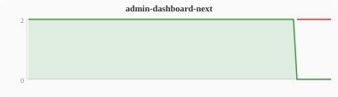</td><td>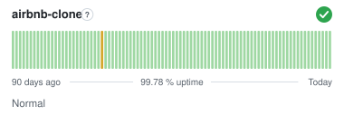</td></tr><tr><td>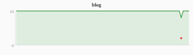</td><td>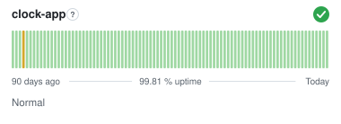</td></tr><tr><td>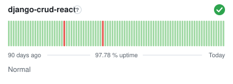</td><td>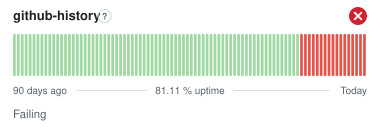</td></tr><tr><td>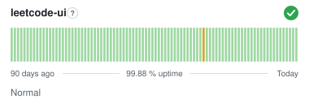</td><td>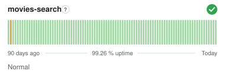</td></tr><tr><td>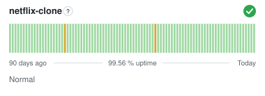</td><td>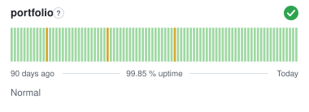</td></tr><tr><td>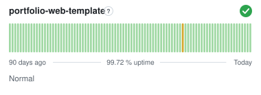</td><td>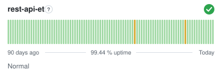</td></tr><tr><td>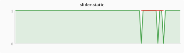</td><td>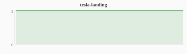</td></tr><tr><td>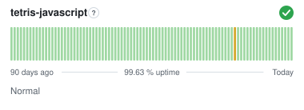</td><td>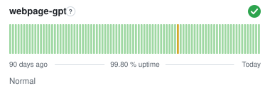</td></tr></table>